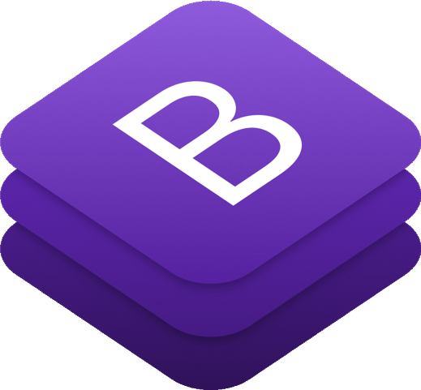

# Hello there  My name is Idris Yigit 

## I am on my way to be a self-taught Frontend Web Developer
- 🔭 I'm currently developing projects at <a href=https://www.patika.dev/tr>Patika.dev</a> and <a href=https://www.freecodecamp.org/learn>freeCodeCamp</a>.
- 🌱 I’m currently learning JavaScript.
- 💞️ I’m looking to collaborate with anyone on Frontend projects.

## ✉️ Find me on:

    
    

## 🧰 Language and Tools:

    
    
    
    

## 🚀 My Projects

<table>
  <tr > 
      <th>HTML & CSS Only</th>
      <th>Bootstrap</th>   
      <th>JavaScript</th>     
  </tr>

  <tr style="text-align:center;">
    <td><a href="https://github.com/idrisyigit/Google1998-Clone" target="_blank">Google 1998</a></td>
    <td><a href="https://github.com/idrisyigit/Music-Store" target="_blank">Music Store</a></td>
    <td>Coming Soon</td>
  </tr>
  <tr style="text-align:center;">
    <td><a href="https://github.com/idrisyigit/Google-Clone" target="_blank">Google</a></td>
    <td><a href="https://github.com/idrisyigit/Bootstrap-Task" target="_blank">Landing Page</a></td>
    <td></td>
  </tr>
  <tr style="text-align:center;">
    <td><a href="https://github.com/idrisyigit/QR-Code" target="_blank">QR Code</a></td>
    <td><a href="https://github.com/idrisyigit/Instagram-Clone" target="_blank">Instagram Clone</a></td>
    <td></td>
  </tr>
  <tr style="text-align:center;">
    <td><a href="https://github.com/idrisyigit/Cafe-Menu" target="_blank">Cafe Menu</a></td>
    <td><a href="https://github.com/idrisyigit/Medium-Clone" target="_blank">Medium Clone</a></td>
    <td></td>
  </tr>
  <tr style="text-align:center;">
    <td><a href="https://github.com/idrisyigit/Colored-Markers" target="_blank">Colored Markers</a></td>
    <td><a href="https://github.com/idrisyigit/LinkedIn-Clone" target="_blank">LinkedIn Clone</a></td>
    <td></td>
  </tr>
  <tr style="text-align:center;">
    <td><a href="https://github.com/idrisyigit/Registration-Form" target="_blank">Registration Form</a></td>
    <td></td>
    <td></td>
  </tr>
  <tr style="text-align:center;">
    <td><a href="https://github.com/idrisyigit/Survey-Form" target="_blank">Survey Form</a></td>
    <td></td>
    <td></td>
  </tr>
  <tr style="text-align:center;">
    <td><a href="https://github.com/idrisyigit/Rothko-Painting" target="_blank">Rothko Painting</a></td>
    <td></td>
    <td></td>
  </tr>
  <tr style="text-align:center;">
    <td><a href="https://github.com/idrisyigit/Photo-Gallery" target="_blank">Photo Gallery</a></td>
    <td></td>
    <td></td>
  </tr>
  <tr style="text-align:center;">
    <td><a href="https://github.com/idrisyigit/Nutrition-Label" target="_blank">Nutrition Label</a></td>
    <td></td>
    <td></td>
  </tr>
  <tr style="text-align:center;">
    <td><a href="https://github.com/idrisyigit/Quiz" target="_blank">Quiz Form</a></td>
    <td></td>
    <td></td>
  </tr>
  <tr style="text-align:center;">
    <td><a href="https://github.com/idrisyigit/Tribute-Page" target="_blank">Tribute Page</a></td>
    <td></td>
    <td></td>
  </tr>
  <tr style="text-align:center;">
    <td><a href="https://github.com/idrisyigit/Balance-Sheet" target="_blank">Balance Sheet</a></td>
    <td></td>
    <td></td>
  </tr>
  <tr style="text-align:center;">
    <td><a href="https://github.com/idrisyigit/Picasso-Painting" target="_blank">Picasso Painting</a></td>
    <td></td>
    <td></td>
  </tr>
   <tr style="text-align:center;">
    <td><a href="https://github.com/idrisyigit/Piano" target="_blank">Piano</a></td>
    <td></td>
    <td></td>
  </tr>
  </tr>
   <tr style="text-align:center;">
    <td><a href="https://github.com/idrisyigit/Technical-Documentation-Page" target="_blank">Technical Documentation Page</a></td>
    <td></td>
    <td></td>
  </tr>
  <tr style="text-align:center;">
    <td><a href="https://github.com/idrisyigit/City-Skyline" target="_blank">City Skyline</a></td>
    <td></td>
    <td></td>
  </tr>
  <tr style="text-align:center;">
    <td><a href="https://github.com/idrisyigit/Magazine" target="_blank">Magazine</a></td>
    <td></td>
    <td></td>
  </tr>
  <tr style="text-align:center;">
    <td><a href="https://github.com/idrisyigit/Product-Landing-Page" target="_blank">Product Landing Page</a></td>
    <td></td>
    <td></td>
  </tr>
  <tr style="text-align:center;">
    <td><a href="https://github.com/idrisyigit/Ferris-Wheel" target="_blank">Ferris Wheel</a></td>
    <td></td>
    <td></td>
  </tr>
  <tr style="text-align:center;">
    <td><a href="https://github.com/idrisyigit/Penguin" target="_blank">Penguin</a></td>
    <td></td>
    <td></td>
  </tr>
  
 </table>

<!---
idrisyigit/idrisyigit is a ✨ special ✨ repository because its `README.md` (this file) appears on your GitHub profile.
You can click the Preview link to take a look at your changes.
--->
